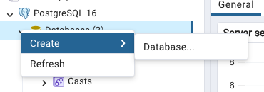
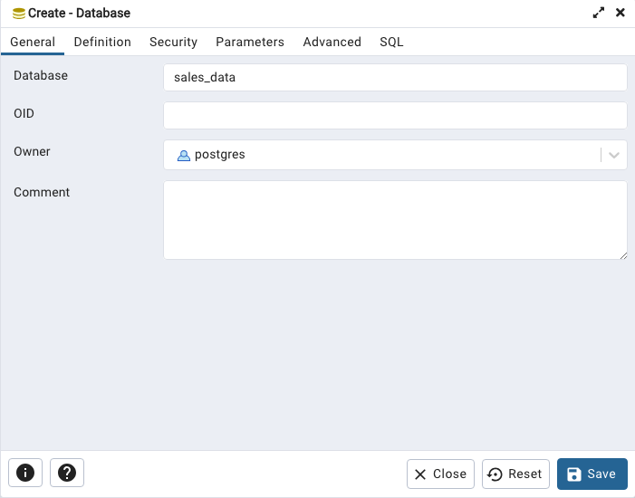

# Multinational Retail Data Centralisation

## Table of Contents

- [Project Brief](#project-brief)

  - [Data](#data)
  - [Key Tools](#key-tools)
  - [Key Objectives](#key-objectives)

- [Installation instructions](#installation-instructions)
  - [Get Started](#get-started)
  - [Connect to the local database using pgAdmin4](#connect-to-the-local-database-using-pgadmin4)
- [File structure](#file-structure)
- [Usage instructions](#usage-instructions)

  - [Connect, extract, and clean the data](#1-connect-extract-and-clean-the-data)
  - [Create database schema](#2-create-database-schema)
  - [Query the data in pgadmin4 to generate insights](#3-query-the-data-in-pgadmin4-to-generate-insights)
- [Query Results](#query-results)
- [License Information](#license-information)

## Project Brief

A multinational company sells various goods across the globe.

Currently, their sales data is spread across many different data sources making it not easily accessible or analysable.

In this project, sales data is collected and extracted from multiple sources. The data is then cleaned and uploaded to a SQL database, where the data can be managed effectively to provide data-driven insights on the company.

### Data

There are five different data sources that we connect and extract data from to gather insights on the retail data. They cover data on the `products`, `orders`, `dates` (of orders), `store_details`, and `card_details`.

The data is extracted from:

- two tables of an SQL database hosted on AWS RDS
- one table stored as a .pdf file hosted on AWS S3
- one table stored as a .csv file hosted on AWS S3
- one table stored as a .json file hosted on AWD S3
- a series of JSON objects available via an API.

### Key Tools

#### pandas

[pandas](https://pandas.pydata.org/) is a fast, powerful, flexible and easy to use open source data analysis and manipulation tool, built on top of the Python programming language. A pandas dataframe is a two-dimensional data structure, similar to a table. The library has many in-built methods making it easy to manipulate and visualise large sets of data.

```python
# It is common for pandas to be abbreviated to pd
import pandas as pd
```

This project utilises many of pandas built in methods. A few common examples are listed below:

```python
# Read SQL table from database connection established using SQLAlchemy
dataframe = pd.read_sql_table(table_name, engine)
# Read contents of csv into DataFrame
dataframe = pd.read_csv('file.csv')
# Read contents of json into DataFrame
dataframe = pd.read_json('file.json')
# Drop rows containing null values
dataframe.dropna(inplace=True)
# Convert a DataFrame column to datetime type
pd.to_datetime(dataframe['column_name'])
# Converts a DataFrame column to string type
dataframe['column_name'].astype('string')
# Replace a character with a new character in a DataFrame column
dataframe['column_name'].str.replace('char', 'new_char')
# Set values to nan if value in DataFrame column does not follow pattern
dataframe.loc[~dataframe['column_name'].str.match(pattern), 'column_name'] = np.nan
```

#### numPy

[numPy](https://numpy.org/) serves as the essential package for scientific computing in Python, providing speed and versatility through its array computing standards. It includes a wide range of comprehensive mathematical functions, random number generators, linear algebra routines, Fourier transforms, and more.

```python
# It is common for numpy to be abbreviated to np
import numpy as np
```

In this project, we have numPy to set nan values.

```python
# An example from src/data_cleaning.py
# Set values to nan if the country_code length is larger than 2.
df.loc[df.country_code.str.len() > 2, 'country_code'] = np.nan
```

#### SQLAlchemy

[SQLAlchemy](https://www.sqlalchemy.org/) is the Python SQL toolkit, which has been used to connect to both the AWS and local SQL databases.

In `src/database_utils.py`, the library has been used in the following way:

```python
from sqlalchemy import create_engine, inspect
```

From the [SQLAlchemy documentation](https://docs.sqlalchemy.org/en/20/tutorial/engine.html),

> The start of any SQLAlchemy application is an object called the **Engine**. This object acts as a central source of connections to a particular database, providing both a factory as well as a holding space called a connection pool for these database connections. The engine is typically a global object created just once for a particular database server, and is configured using a URL string which will describe how it should connect to the database host or backend.

For example, in the `init_db_engine()` in `src/database_utils.py`, SQLAlchemy has been used in the following way:

```python
# Construct database_url to connect to
database_url = (
        f"postgresql://{self.db_creds['RDS_USER']}:{self.db_creds['RDS_PASSWORD']}"
        f"@{self.db_creds['RDS_HOST']}:{self.db_creds['RDS_PORT']}/{self.db_creds['RDS_DATABASE']}"
        )
# Create new sqlalchemy database engine
db_engine = create_engine(database_url)
```

The library is also used in the `list_db_tables()` function in `src/database_utils.py`.

```python
# Gather information on database
inspector = inspect(self.db_engine)
# Retrieve table names of database
db_table_list = inspector.get_table_names()
```

#### PyYAML

[PyYAML](https://pypi.org/project/PyYAML/) is used to read the YAML files that contain the database credentials. The contents are then loaded into a dictionary. This allows access to the credentials to pass into the create_engine() method above.

In the `read_db_engine()` method in `src/data_extraction.py`, the library has been used like so:

```python
import yaml

# Use context manager to open file
with open(self.file_path, 'r') as file:
  # Load the contents into a dictionary
  db_creds = yaml.safe_load(file)
```

#### boto3

[boto3](https://boto3.amazonaws.com/v1/documentation/api/latest/index.html) is the AWS SDK for Python. It creates, configures, and manages AWS services, in Python. It is used to extract a CSV file from an S3 bucket and returns its data as a pandas DataFrame.

In the `extract_from_s3()` method in `src/data_extraction.py`,

```python
# Import boto3 library to interact with Amazon S3
s3 = boto3.client('s3')

# Retrieve an object from an S3 bucket using its bucket name and file key
response = s3.get_object(Bucket=bucket_name, Key=file_key)

# Extract the content of the S3 object's body
data = response['Body']
```

#### requests

[requests](https://pypi.org/project/requests/) allows you to send HTTP/1.1 requests extremely easily. It is used to make HTTPS GET requests.

In `src/data_extraction.py`,

```python
import requests

# Make HTTPS GET request using URL of API endpoint and any necessary headers, i.e. x-api-key
response = requests.get({API_URL}, headers={HEADER_DICTIONARY})
# If connection made, create pandas DataFrame from request
if response.status_code == 200:
  data = response.json()
  df = pd.json_normalize(data)
```

#### tabula-py

[tabula-py](https://pypi.org/project/tabula-py/) is a simple Python wrapper of tabula-java, which can read tables in a PDF. You can read tables from a PDF and convert them into a pandas DataFrame.

In the `retrieve_pdf_data()` method in `src/data_extraction.py`,

```python
import tabula

# Read all pages of pdf
pdf_pages = tabula.read_pdf(pdf_link, pages='all')
# Store pages in a pandas DataFrame
pdf_data = pd.concat(pdf_pages, ignore_index=True)
```

## Key Objectives

In this project, we learn:

1. How to **connect** and **extract** data from multiple sources e.g. a csv file, a PDF, an S3 Bucket, an API, and a json file.
2. How to **clean** data effectively by considering NULL values, duplicates, valid data types, incorrectly typed values, wrong information, and formatting.
3. How to **organise** code effectively into suitable classes to connect, extract, and clean data.
4. How to **query** the data using pgAdmin 4 to cast data types, manipulate the tables, and set primary and foreign keys.
5. How to query the data using pgAdmin 4 to **generate insights** such as:
   - Which locations have the most stores?
   - Which month produced the largest number of sales?
   - How many sales are coming from online?
   - What percentage of sales come through each type of store?

## Installation instructions

### Get Started

To get started with this project, follow these steps to set up your environment:

#### 1. Clone the repository

```bash
git clone https://github.com/elishagretton/multinational-retail-data-centralisation939.git
cd multinational-retail-data-centralisation939
```

#### 2. Set up a virtual environment

```bash
# On Unix or MacOS
python3 -m venv venv

# On Windows
python -m venv venv
```

#### 3. Activate the virtual environment

```bash
# On Unix or MacOS
source venv/bin/activate

# On Windows
.\venv\Scripts\activate
```

#### 4. Install the dependencies.

```bash
pip install -r requirements.txt
```

### Connect to the local database using pgAdmin4

pgAdmin is used to connect to the local database. With pgAdmin installed and running, we create a database to upload the data to with these steps:

#### 1. On the main application page, right click on Databases. Select Create -> Database.



#### 2. On the 'General' tab of the dialogue that appears, enter a name for the new server connection



## File structure

The project is structured as follows:

- **/src**: Contains source code files.

  - `database_utils.py`: Utility functions for database operations such as connecting to data sources.
  - `data_extractor.py`: Handles data extraction.
  - `data_cleaning.py`: Manages data cleaning once data has been extracted from source.

- **/tasks**: Includes task files.

  - **/preprocessing**: Includes .ipynb preprocessing files that extract, clean, and upload tables to SQL.
    - `card_details.ipynb`
    - `dates.ipynb`
    - `orders.ipynb`
    - `products.ipynb`
    - `store_details.ipynb`
    - `orders.ipynb`
  - **/queries**: Includes creation of database schema and data insights.
    - **/database_schema**: Individual .sql files to query the data (cast new types, manipulate tables, and set primary and foreign keys.)
      - `card_details.sql`
      - `dates.sql`
      - `orders.sql`
      - `products.sql`
      - `store_details.sql`
    - `data_insights.sql`: SQL file that generates insights from the data tables.

- **.gitignore**: Specifies files and directories to ignore in version control.

- **README.md**: Documentation file with essential information.

- **LICENSE.txt**: File containing information on MIT License used in this project.
- **requirements.txt**: File containing modules to install.

## Usage instructions

#### 1. Connect, extract, and clean the data

Data is first extracted and cleaned before being uploaded to pgadmin4. The `preprocessing` folder contains individual .ipynb files that connect, extract, clean each data source (`card_details`, `dates`, `orders`, `products`, `store_details`, and `users`). The data is then uploaded to a table in pgAdmin 4.

```python
# Locate to preprocessing folder
cd tasks/preprocessing
# Run preprocessing of dates data
python dates.ipynb
```

#### 2. Create database schema

The `queries` folders contains a `database_schema` folder that contains individual .sql files to create the schema. To do this, we cast data types, manipulate the tables, and set primary and foreign keys.

Upload the files into pgadmin and run.

####  3. Query the data in pgadmin4 to generate insights

The `queries` folders also contains a `data_insights.sql` file which interrogates the data and generates insights.

Upload the file into pgadmin and run.

## Query Results

#### Task 1: How many stores does the business have and what countries do they operate in?

```sql
SELECT
    country_code,
    COUNT(*) AS total_no_stores
FROM
    dim_store_details
WHERE
    country_code IN ('GB', 'DE', 'US')
GROUP BY
    country_code
ORDER BY
    total_no_stores DESC;
```

**Results:**

| country_code | total_no_stores |
| -------- | -------- | 
|GB | 265 |
| DE | 141 | 
| US | 34 | 

There are 265 stores in Great Britain, 141 in Germany, and 34 in America.

#### Task 2: Which locations have the most stores?

```sql
SELECT
    locality,
    COUNT(*) AS total_no_of_stores
FROM
    dim_store_details
GROUP BY
    locality
ORDER BY
    total_no_of_stores DESC
LIMIT 7;
```

**Results:**

| locality | total_no_stores |
| -------- | -------- | 
|Chapletown | 14 |
| Belper | 13 | 
| Bushey | 12 | 
| Exeter | 11 | 
| High Wycombe | 10 | 
| Rutherglen | 10 | 
| Arbroath | 10 | 

In the table above, it shows the top 7 locations with the most stores. The town with the most stores is Chapletown with a total of 14.

#### Task 3: Which month produced the largest number of sales?

```sql
SELECT 
    ROUND(SUM(orders_table.product_quantity * dim_products.product_price)::numeric, 2) AS total_sales,
    dim_date_times.month
FROM 
    orders_table
JOIN 
    dim_products ON orders_table.product_code = dim_products.product_code
JOIN 
    dim_date_times ON orders_table.date_uuid = dim_date_times.date_uuid
GROUP BY
    dim_date_times.month
ORDER BY 
    total_sales DESC
LIMIT 6;
```

**Results:**

| total_sales | month |
| -------- | -------- | 
|673295.68 | 8.0 |
| 668041.45	 | 1.0 | 
| 657335.84 | 10.0 | 
| 650321.43 | 5.0 | 
| 645741.70 | 7.0 | 
| 645463.00	 | 3.0 | 

The month that produced the largest amount of sales was August, with a total of 673295.68 sales.

#### Task 4: How many sales are coming from online?

```sql
SELECT
    COUNT(orders_table.product_quantity) AS numbers_of_sales,
    SUM(orders_table.product_quantity) AS product_quantity_count,
    CASE
        WHEN dim_store_details.locality IS NULL THEN 'Web'
        ELSE 'Offline'
    END AS location
FROM
    orders_table
JOIN
    dim_store_details ON orders_table.store_code = dim_store_details.store_code
GROUP BY
    location
ORDER BY
    numbers_of_sales;
```

**Results:**

| number_of_sales | product_quantity_count | location |
| -------- | -------- | -------- | 
|26957 | 107739 | Web |
| 93166 | 374047 | Offline |

There is a total of 26957 sales coming from online.

#### Task 5: What percentage of sales come through each type of store?

```sql
SELECT
    dim_store_details.store_type AS store_type,
    ROUND(SUM(orders_table.product_quantity * dim_products.product_price)::numeric, 2) AS total_sales,
    ROUND((SUM(orders_table.product_quantity * dim_products.product_price) /
        (SELECT 
            SUM(orders_table.product_quantity * dim_products.product_price)
        FROM 
            orders_table
        JOIN dim_products ON orders_table.product_code = dim_products.product_code) * 100)::numeric, 2) 
    AS "percentage_total(%)"
FROM 
    orders_table
JOIN 
    dim_products ON orders_table.product_code = dim_products.product_code
JOIN 
    dim_store_details ON orders_table.store_code = dim_store_details.store_code
GROUP BY
    store_type
ORDER BY
    "percentage_total(%)" DESC;
```
**Results:**
|store_type|total_sales|percentage_total(%)|
| -------- | -------- | -------- | 
| Local |	3440896.52 | 44.56 |
| Web Portal | 1726547.05	| 22.36
| Super Store | 1224293.65 | 15.85
| Mall Kiosk | 698791.61 | 9.05
| Outlet | 631804.81 | 8.18

- 44.56% of total sales comes from local stores.
- 22.36% of total sales come from web portal stores.
- 15.85% of total sales come from super stores.
- 9.05% of total sales come from mall kiosks.
- 8.18% of total sales come from outlet stores.

#### Task 6: Which month in each year produced the highest cost of sales?

```sql
SELECT
    ROUND(SUM(orders_table.product_quantity * dim_products.product_price)::numeric, 2) AS total_sales,
    dim_date_times.year AS year,
    dim_date_times.month AS month
FROM 
    orders_table
JOIN 
    dim_products ON orders_table.product_code = dim_products.product_code
JOIN 
    dim_date_times ON orders_table.date_uuid = dim_date_times.date_uuid
GROUP BY
    year, month
ORDER BY
    total_sales DESC
LIMIT 10;
```

**Results:**

|total_sales|year|month|
| -------- | -------- | -------- | 
| 27936.77	| 1994.0 |	3.0|
| 27356.14	| 2019.0 |	1.0|
|27091.67	| 2009.0 |	8.0 |
|26679.98	|1997.0|	11.0|
|26310.97|2018.0|	12.0|
|26277.72|2019.0|	8.0|
|26236.67|2017.0|	9.0|
|25798.12|2010.0|	5.0|
|25648.29|1996.0|	8.0|
|25614.54|2000.0|	1.0|

March produced the highest amount of sales, with a total of 27936.77 sales.

#### Task 7: What is our staff headcount?
```sql
SELECT
    SUM(staff_numbers) AS total_staff_numbers,
    country_code as country_code
FROM   
    dim_store_details
GROUP BY
    country_code
ORDER BY
    total_staff_numbers DESC;
```

**Results:**

|total_staff_count|country_code|
| -------- | -------- |
| 12982	| GB|
|6123	|DE|
|1384	|US|
|325	| null |

In total, there are 20814 employees across all regions.
- There are 12982 employees in Great Britain.
- There are 6123 employees in Germany.
- There are 1384 employees in America.
- There are 325 employees with no given country code.

#### Task 8: Which German store type is selling the most?

```sql
SELECT
    ROUND(SUM(orders_table.product_quantity * dim_products.product_price)::numeric, 2) AS total_sales,
    dim_store_details.store_type AS store_type,
    dim_store_details.country_code AS country_code
FROM 
    orders_table
JOIN 
    dim_products ON orders_table.product_code = dim_products.product_code
JOIN 
    dim_store_details ON orders_table.store_code = dim_store_details.store_code
WHERE 
    dim_store_details.country_code = 'DE'
GROUP BY
    store_type, country_code 
ORDER BY
    total_sales ASC;
```
**Results:**

|total_sales|store_type|country_code|
| -------- | -------- | -------- | 
| 198373.57|Outlet|DE|
|247634.20|Mall Kiosk|DE|
|384625.03|Super Store|DE|
|1109909.59|Local|DE|

The German store type which is selling the most are local stores. They have the highest total sales of 1109909.59.

#### Task 9: How quickly is the company making sales?

```sql
WITH sales_date AS (
    SELECT 
        year,
        TO_TIMESTAMP(CONCAT(year, '-', month, '-', day, ' ', timestamp), 'YYYY-MM-DD HH24:MI:SS') AS sales_date_column,
        LAG(TO_TIMESTAMP(CONCAT(year, '-', month, '-', day, ' ', timestamp), 'YYYY-MM-DD HH24:MI:SS')) OVER (PARTITION BY year ORDER BY TO_TIMESTAMP(CONCAT(year, '-', month, '-', day, ' ', timestamp), 'YYYY-MM-DD HH24:MI:SS')) AS previous_sale_date
    FROM 
        dim_date_times
)
SELECT 
    year,
    '{"hours": ' || EXTRACT(HOUR FROM AVG(sales_date_column - previous_sale_date)) || ', "minutes": ' || EXTRACT(MINUTE FROM AVG(sales_date_column - previous_sale_date)) || ', "seconds": ' || EXTRACT(SECOND FROM AVG(sales_date_column - previous_sale_date)) || ', "milliseconds": ' || EXTRACT(MILLISECOND FROM AVG(sales_date_column - previous_sale_date)) || '}' AS actual_time_taken
FROM 
    sales_date
WHERE 
    previous_sale_date IS NOT NULL
GROUP BY 
    year
ORDER BY 
    AVG(sales_date_column - previous_sale_date) DESC
LIMIT 5;
```

**Results:**
|year|actual_time_taken|
| -------- | -------- |
| 2013 | "hours": 2, "minutes": 17, "seconds": 12, "millise... |
| 1993 | "hours": 2, "minutes": 15, "seconds": 35, "millise... |
| 2002 | "hours": 2, "minutes": 13, "seconds": 50, "millise... | 
| 2022 | "hours": 2, "minutes": 13, "seconds": 6,  "millise... |
| 2008 | "hours": 2, "minutes": 13, "seconds": 2,  "millise... |
 
- In 2013, the company made sales in approximately 2hrs 17 minutes 12 seconds.
- In 1993, the company made sales in approximately 2hrs 15 minutes 35 seconds.
- In 2002, the company made sales in approximately 2hrs 13 minutes 50 seconds.
- In 2022, the company made sales in approximately 2hrs 13 minutes 6 seconds.
- In 2008, the company made sales in approximately 2hrs 13 minutes 2 seconds.

## License Information

This project is licensed under the MIT License - see the [LICENSE.txt](LICENSE.txt) file for details.
